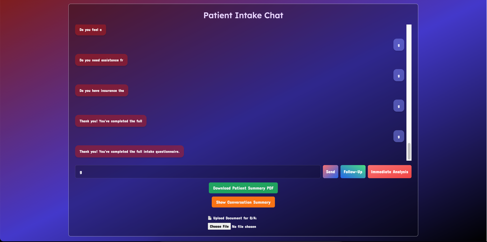

# Patient Intake Chat Assistant

Welcome to our AI-powered medical intake assistant — an intelligent system designed to **streamline patient onboarding**, improve healthcare workflows, and facilitate early diagnosis insights with the help of large language models.

Table number: 15
Hacker ID: idk
---

## Overview

This project combines the conversational abilities of **Gemini 2.0 Flash** with a clean and intuitive web interface to create a **virtual intake assistant** for clinics, hospitals, and telehealth platforms.

Users can chat with an AI agent to:
- Answer structured health intake questions
- Ask follow-up questions about their previous answers
- Analyze symptoms for potential health risks
- Upload documents and ask questions about their contents
- Download a beautifully formatted **PDF summary** of their responses

---

## Project Screenshot



---

## Core Features

### Smart Intake Conversation
The assistant walks the patient through 30+ essential health questions covering:
- Basic demographics
- Chronic conditions
- Surgical history
- Mental health
- COVID-19 impact
- Self-management and insurance

### Follow-Up Understanding
Patients can click "Follow-Up" to ask the AI clarifying questions about any previous answer — just like they'd ask a real nurse.

### PDF Summary
Once the intake is complete, users can download a structured **PDF report** divided into clinical sections. This helps doctors review patient data efficiently.

### Symptom Analyzer
Users can press "Immediate Analysis" to describe symptoms and receive:
- 3 possible causes
- A life-threatening risk assessment
- A risk rating (1–10)

### Document Upload & Q&A
Patients can upload documents (like prior medical reports) and ask targeted questions about their contents.

---

## Technologies Used

| Layer        | Tools/Frameworks                                |
|--------------|--------------------------------------------------|
| Frontend     | React, Tailwind CSS, Axios                       |
| Backend      | FastAPI, Python, FPDF, dotenv                    |
| AI Engine    | Gemini 2.0 Flash API (Google Generative AI)     |
| PDF Export   | FPDF (Python-based PDF generation)              |
| Deployment   | Localhost + Future plans for Docker/Azure       |

(Make sure you have all the modules installed locally!)

---

## How to Run It Locally

### Requirements

- Python 3.10+
- Node.js (for frontend)
- `.env` file with your API key

### Create your `.env` file

```env
GEMINI_API_KEY=your_google_gemini_api_key
